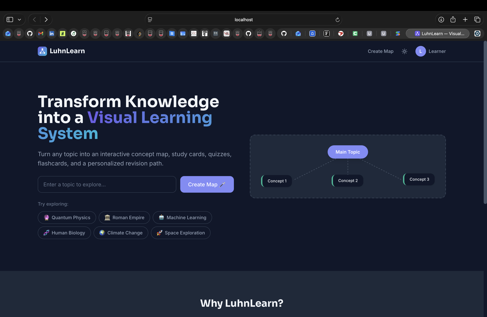
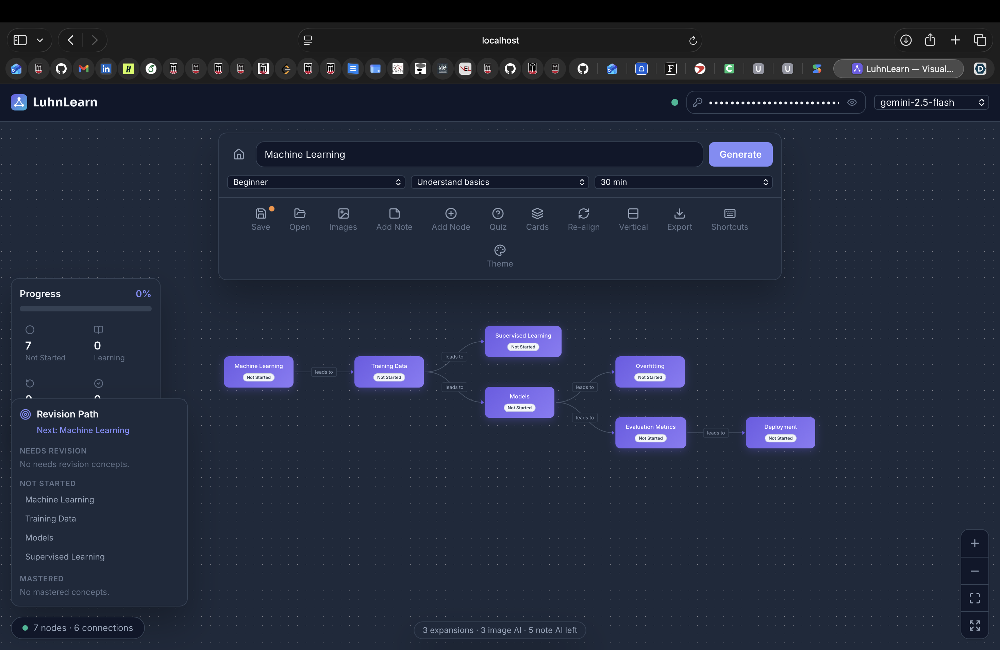
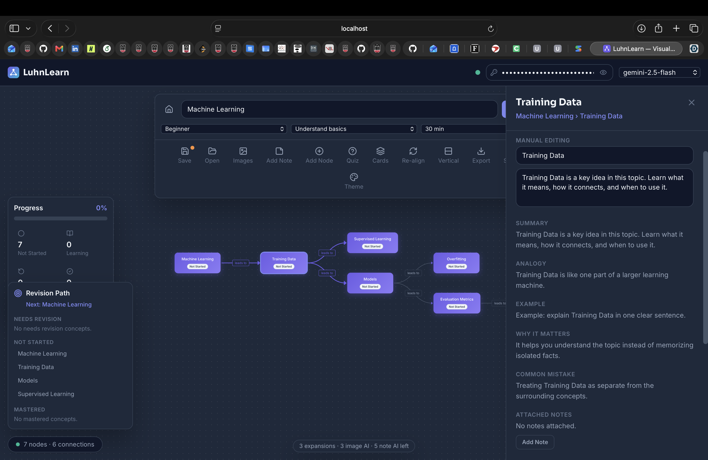
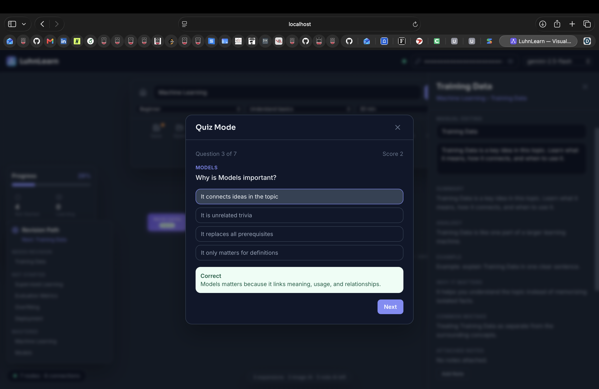
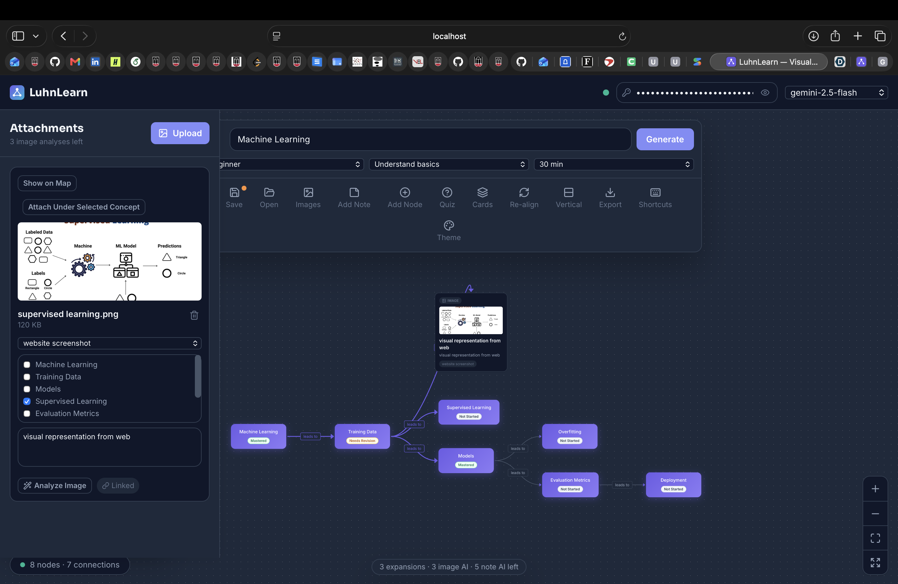

# LuhnLearn

An AI-powered visual learning system that turns any topic into an interactive
concept map, study cards, quizzes, flashcards, and a personalized revision path.
Enter a topic, choose a difficulty, learning goal, and time budget, and Google
Gemini generates a structured learning map you can study on a draggable canvas.

## Tech stack

- React 18 (JavaScript) + Vite
- React Flow (`@xyflow/react`) for the node/edge canvas
- Dagre (`@dagrejs/dagre`) for automatic hierarchical layout
- Tailwind CSS 3 with CSS-variable theming (light/dark)
- React Router v6, Lucide icons, react-hot-toast, html-to-image, uuid
- Google Gemini (`gemini-2.0-flash`) as the LLM backend

## Setup

1. Install dependencies:

   ```bash
   npm install
   ```

2. Add your Gemini API key. Copy `.env.example` to `.env` (already created with a
   placeholder) and set your key — get a free one at
   <https://aistudio.google.com/app/apikey>:

   ```
   VITE_LLM_API_KEY=your_real_key_here
   VITE_LLM_MODEL=gemini-2.0-flash
   VITE_LLM_BASE_URL=https://generativelanguage.googleapis.com/v1beta
   ```

   > Map generation will error until a real key is set — that's expected.

3. Run the dev server:

   ```bash
   npm run dev
   ```

   Open <http://localhost:5173>.

### Runtime API key + model (no restart)

You can also set the Gemini **API key** and **model** at runtime from the top bar
on the map page — paste a key and pick a model (or choose **Custom…** for any
model id). These values are stored in `localStorage` and **override** `.env`, so
you don't need to edit files or restart the dev server. A status dot turns green
when a key is set; clear the field to fall back to the `.env` key. If the key is
missing, invalid, rate-limited, or the model is unavailable, a specific error
toast explains what to fix.

## Scripts

- `npm run dev` — start the dev server
- `npm run build` — production build to `dist/`
- `npm run preview` — preview the production build
- `npm run lint` — run ESLint

## Keyboard shortcuts (map page)

`F` fit view · `R` re-align · `L` toggle layout · `+`/`-` zoom · `T` theme ·
`?` shortcuts · `Esc` close/clear · `Ctrl/Cmd+S` save · `Ctrl/Cmd+O` open ·
`Ctrl/Cmd+E` export PNG · `Ctrl/Cmd+Shift+E` export SVG

## Project structure

```
src/
├── config/      app constants
├── context/     ThemeContext, MapContext (useReducer)
├── hooks/        useAI, useGraphLayout, useLocalStorage, useKeyboardShortcuts
├── services/     aiService, layoutService, storageService, exportService
├── utils/        graphUtils, colorUtils, formatUtils
└── components/   layout · landing · map · modals · ui
```
## Screenshots

### Landing Page


### Concept Map


### Node Study Panel


### Quiz Mode


### Image Upload
